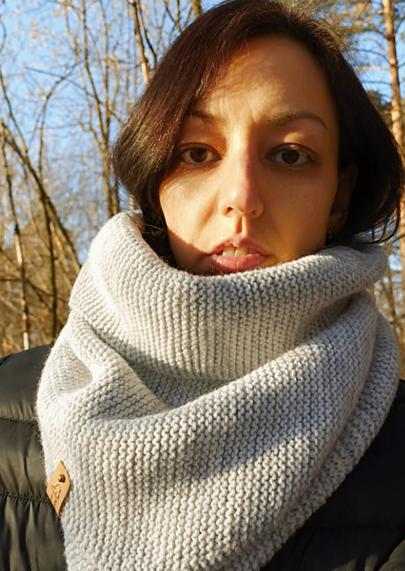

# Всем привет!
# Давайте знакомиться!
- Меня зовут Ольга;
- Живу в Москве;
- Училась в МГТУ им. Баумана и в МГЮА;
- Знаю немного английский и французский;
- Люблю читать, ходить в театр, гулять на природе;
- Люблю животных, у меня живут две собаки и кот;
- Мне нравится вязать, вяжу шарфы, шапки, свитера, игрушки;
  [Мои вязаные изделия](https://www.livemaster.ru/olka258)
